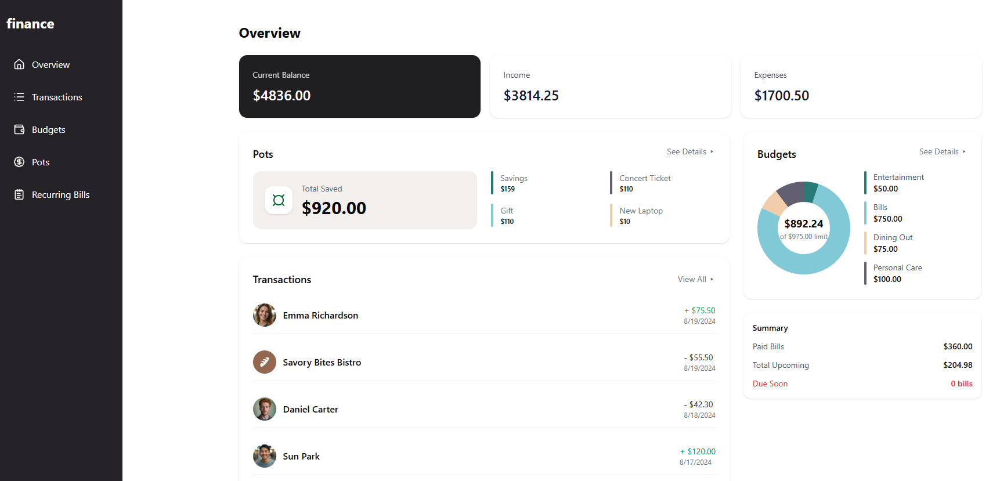

# Frontend Mentor - Personal finance app form with success message

This is a solution to the
[Personal finance app form with success message challenge on Frontend Mentor](https://www.frontendmentor.io/challenges/personal-finance-app-JfjtZgyMt1).
Frontend Mentor challenges help you improve your coding skills by
building realistic projects.

## Table of contents

- [Frontend Mentor - Personal finance app form with success message](#frontend-mentor---personal-finance-app-form-with-success-message)
  - [Table of contents](#table-of-contents)
  - [Overview](#overview)
    - [Screenshot](#screenshot)
    - [Links](#links)
  - [My process](#my-process)
    - [Built with](#built-with)

## Overview

### Screenshot

### Links

- Solution URL: [https://github.com/mehdias63/Personal-finance-app]
- Live Site URL: [https://personal-finance-app-zeta-one.vercel.app/]

## My process

### Built with

- [Next.js Documentation](https://nextjs.org/docs) - learn about
  Next.js features and API.
- [Learn Next.js](https://nextjs.org/learn) - an interactive Next.js
  tutorial.
- [Tailwind](https://tailwindcss.com/) - For styles
